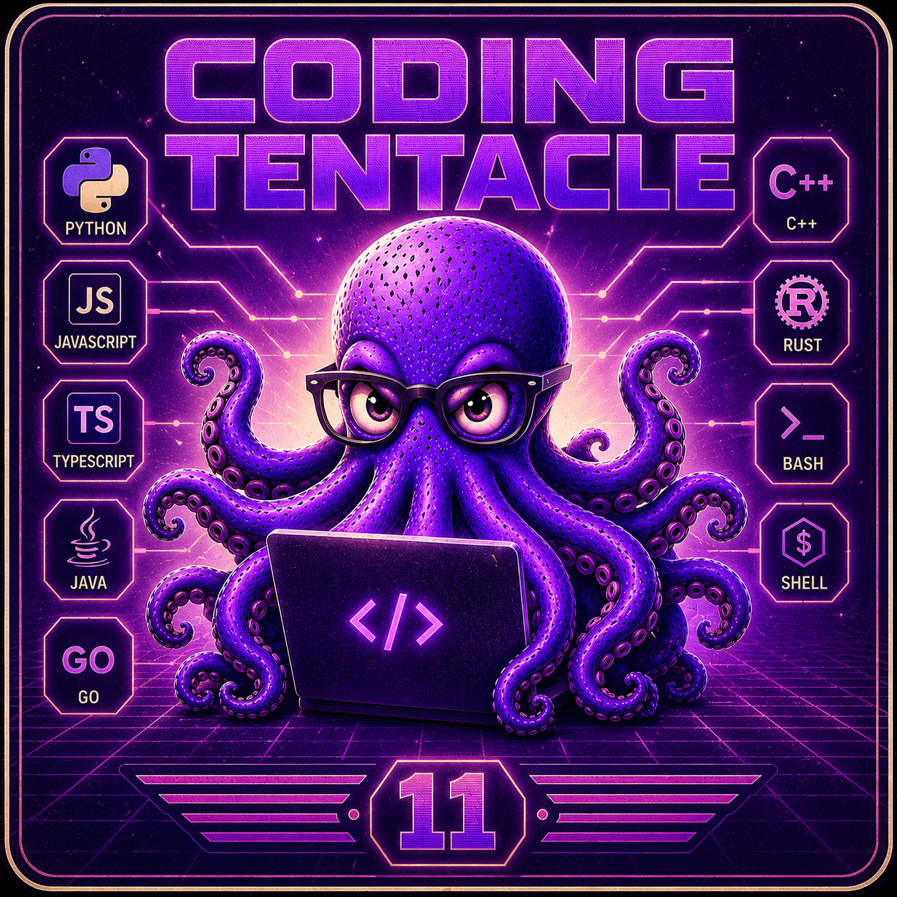

<p align="center">
  
</p>

<h1 align="center">Coding Tentacle 11</h1>

<p align="center">
  <strong>🐙 Secure Self-Learning Repair Agent — Droste Fusion</strong><br>
  <em>The only agent with Safety VETO + Causal Code Graph + Self-Learning</em>
</p>

<p align="center">
  
  
  
  
  <a href="https://github.com/nessos666/droste-memory"></a>
  
  
</p>

---

## Why Coding Tentacle?

**The Problem:** AI coding agents — OpenCode, Claude Code, Codex, Copilot — generate code with **zero safety guarantees**. They can emit `eval(user_input)`, `DROP TABLE`, or `rm -rf /` without hesitation. They use grep, not code graphs. They never learn from mistakes.

**The Solution:** Coding Tentacle is a **Cyber-Safety Layer** that sits between bug reports and fix engines. It doesn't generate code — it **controls** what code gets generated.

| Metric | CT + OpenCode + Droste | Baseline (grep-only) |
|--------|:----------------------:|:---------------------:|
| **Repair Accuracy** | **9/10 (90%)** | 3/10 (30%) |
| **Security Blocks** | 2 (eval, API key) | 0 |
| **Causal Context** | 4,697 edges | 0 |
| **Learning Retention** | 92 experiences, 23 REFLECTION entries | None |

> **3× improvement** over grep-only baselines. Security VETO catches dangerous patterns before execution.

## Architecture

```
                          ┌──────────────────────────────────┐
  Bug Report ────────────►│        CODING TENTACLE            │
                          │                                   │
                          │  ┌─ Classification (18 types) ─┐  │
                          │  │  SecurityBrain VETO         │  │
                          │  │  Droste Causal Graph        │  │
                          │  │  ReflectionEngine           │  │
                          │  │  4-Engine Router            │  │
                          │  └─────────────────────────────┘  │
                          │                                   │
                          │   APPROVE / BLOCK / REQUEST_MORE  │
                          └──────────────┬───────────────────┘
                                         │ controls
  ┌──────────────────────────────────────▼────────────────────┐
  │                    FIX ENGINES                             │
  │                                                           │
  │   OpenCode (deepseek-v4)  │  Claude Code (2.1.86)         │
  │   Ollama (granite3.2)     │  Codex (disabled)             │
  │                                                           │
  │   Sandbox → Safety Scan → Impact Analysis → Approval       │
  │                                                           │
  │   CANNOT act without CT approval. CANNOT bypass safety.    │
  │   CANNOT access files directly. CANNOT auto-commit.        │
  └───────────────────────────────────────────────────────────┘
```

### CT + Droste Fusion

CT uses **[Droste](https://github.com/nessos666/droste-memory)** — a causal code graph engine — to give every fix engine structural context. Instead of blind grep, the LLM sees which functions are **causally connected** to the bug.

```
CODING TENTACLE                         DROSTE v1.1.6
━━━━━━━━━━━━━━━━━━              ┏━━━━━━━━━━━━━━━━━━━━━━━┓
Classifier (18 types)           ┃ 4,187 symbols          ┃
SecurityBrain (VETO)            ┃ 4,697 causal edges     ┃
EngineRouter (4 engines)        ┃ 98% budget efficiency  ┃
ReflectionEngine                ┃ "Which functions are   ┃
BLM + EngineLearning            ┃  causally connected?"  ┃
━━━━━━━━━━━━━━━━━━              ┗━━━━━━━━━━━━━━━━━━━━━━━┛
         │                              │
         └────────── FUSION ────────────┘
                    │
          Causal Code Context in Engine Prompt
```

### Full Pipeline

```
BUG → Classifier → SecurityBrain(VETO) → REFLECTION RETRIEVAL
    → Droste Context → EngineRouter → OpenCode / Claude / Ollama
    → Safety Scan → ImpactAnalyzer → SkepticBrain
    → Sandbox → Approval → BLM → REFLECTION ENGINE → Consolidator
```

## Comparison

| Feature                     | CT | Claude Code | Codex | Copilot | Devin |
|-----------------------------|:--:|:-----------:|:-----:|:-------:|:-----:|
| **Safety VETO (5-layer)**   | ✅ | ❌          | ❌    | ❌      | ❌    |
| **Causal Code Graph**       | ✅ | ❌ grep     | ❌ grep | ❌ grep | ❌ grep |
| **Self-Learning (BLM)**     | ✅ | ❌          | ❌    | ❌      | ❌    |
| **Open Source**             | ✅ | ❌          | ❌    | ❌      | ❌    |
| **Local / No Cloud**        | ✅ | ❌          | ❌    | ❌      | ❌    |
| **Multi-Engine Routing**    | ✅ | ❌          | ❌    | ❌      | ❌    |
| **Immutable Evidence Trail**| ✅ | ❌          | ❌    | ❌      | ❌    |
| **No Auto-Apply**           | ✅ | ❌          | ❌    | ⚠️      | ⚠️    |

**CT is the only system with all 8 features.**

## Engines

| Engine                 | Status   | Type         |
|------------------------|:--------:|-------------|
| OpenCode (deepseek-v4) | Primary  | Local, free  |
| Claude Code (2.1.86)   | Active   | Top-tier     |
| Ollama (granite3.2)    | Fallback | Offline      |
| Codex (GPT-5.x)        | Disabled | API required |

## Learning System V2

```
Run 1: Bug → Fix → REFLECTION: "Why did this work?"
Run 2: Bug → BLM: "I've seen this!" → LEARNED LESSONS enrich prompt
Run N: 92 experiences, 23 REFLECTION entries, trust calibrated
```

## Quick Start

```bash
# Clone and install
git clone https://github.com/nessos666/coding-tentacle.git
cd coding-tentacle
pip install -e .

# Verify installation
ct version

# Repair a bug
ct repair --title "NullPointer in payment.py" --body "NoneType has no attribute 'process'"
```

**Requirements:** Python 3.10+ • [Droste v1.1.6](https://github.com/nessos666/droste-memory) • OpenCode CLI • No API keys • No cloud

## Project Status

| Metric          | Value            |
|-----------------|:----------------:|
| Version         | 11.0.0           |
| Modules         | 27 production    |
| Lines of Code   | 8,405            |
| Test Suite      | 14/14 passing    |
| Regression      | 10/10 passing    |
| Checkpoints     | 28               |
| Archived Modules| 34               |
| CI/CD           | [](https://github.com/nessos666/coding-tentacle/actions) |

## Contributing

Contributions are welcome! Please see [CONTRIBUTING.md](CONTRIBUTING.md) for guidelines and [CODE_OF_CONDUCT.md](CODE_OF_CONDUCT.md) for our community standards.

## License

MIT — Built by [David Miko](https://github.com/nessos666) + [Hermes Agent](https://github.com/nousresearch/hermes-agent). © 2026.
