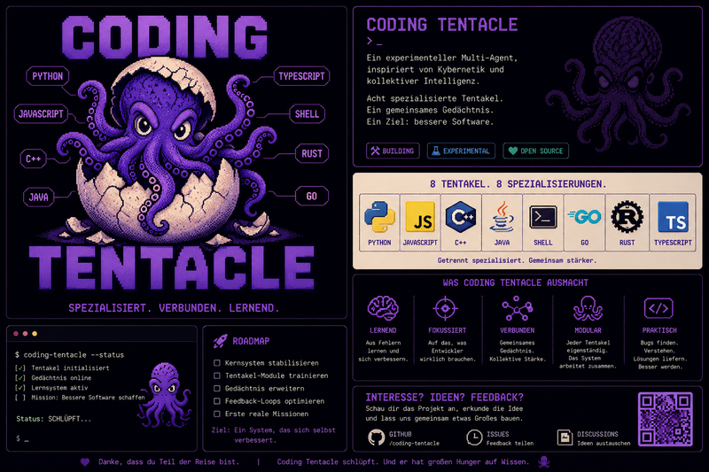

<p align="center">
  
</p>

# 🐙 Coding Tentacle v0.9.0

<p align="center">
  <a href="https://github.com/nessos666/coding-tentacle/blob/main/LICENSE"></a>
  <a href="https://github.com/nessos666/coding-tentacle/releases"></a>
  <a href="#"></a>
  <a href="#"></a>
  <a href="#"></a>
</p>

<p align="center">
  <b>Safety-first guardian layer that controls LLM code-fixing agents.</b><br>
  <i>OpenCode writes fixes. CT analyzes, reviews, blocks danger, requires human approval, and learns from every run.</i>
</p>

---

## Why Coding Tentacle?

OpenCode, Codex, and Claude Code are brilliant at generating code. But they have **zero safety guarantees**. They can output `DROP TABLE`, `eval(user_input)`, or `rm -rf /` — and nothing stops them.

Coding Tentacle sits **in front of** any LLM fix engine and acts as a guardian.

<table>
<tr><td width="200"><b>🛡️ Safety VETO</b></td><td>Blocks dangerous patterns (SQL injection, eval, shell commands) — before execution. Base64 and HTML-encoded payloads are decoded and caught.</td></tr>
<tr><td><b>🔍 SkepticBrain</b></td><td>Adversarial review of every fix. "Why could this be wrong?" Risk score, objections, recommendation.</td></tr>
<tr><td><b>🧠 Self-Learning</b></td><td>BLM stores every bug experience. EngineLearning calibrates trust per engine + bug type. Later runs get better context.</td></tr>
<tr><td><b>🔗 Engine Router</b></td><td>Routes bugs to the best engine. OpenCode primary. Ollama fallback. Codex (API key needed). Bug-type-specific trust routing.</td></tr>
<tr><td><b>👤 Human Approval</b></td><td>Every fix requires human APPROVE/REJECT/REQUEST_CHANGES. Safety VETO can NEVER be overridden — even by humans.</td></tr>
<tr><td><b>📊 Impact Analysis</b></td><td>Predicts which files, tests, skills, and procedures are affected by a change. Risk score before approval.</td></tr>
</table>

---

## Architecture

```
                    ┌─────────────────────────┐
                    │    Coding Tentacle       │
                    │    ┌───────────────────┐ │
  Bug Report ──────►│    │  Safety VETO 🛡️   │ │
                    │    │  SkepticBrain 🔍  │ │
                    │    │  Engine Router 🔗  │ │
                    │    │  Trust Calibration │ │
                    │    │  Learning Loop 🧠  │ │
                    │    └───────┬───────────┘ │
                    │            │             │
                    │    APPROVE / REJECT      │
                    │    / REQUEST_CHANGES     │
                    └────────────┬────────────┘
                                 │
                    ┌────────────▼────────────┐
                    │   Fix Engines            │
                    │   ┌──────┐ ┌──────────┐ │
                    │   │OpenCode│ │ Ollama  │ │
                    │   └──────┘ └──────────┘ │
                    └─────────────────────────┘
```

---

## Quick Start

```bash
git clone https://github.com/nessos666/coding-tentacle.git
cd coding-tentacle

# Verify everything works
python3 scripts/full_regression.py
# → ✅ RC2 ALL TESTS PASSED

# Analyze a bug with full pipeline
python3 -c "
from coding_tentacle.orchestrator.shadow_mode import ShadowModeRunner, GitHubIssueRun
from coding_tentacle.orchestrator.metabrain import MetaBrain, SafetyBrain
from coding_tentacle.safety.inhibitory_control import InhibitoryControl
from coding_tentacle.knowledge.security_store import create_seed_security_store
from coding_tentacle.orchestrator.engine_router import EngineRouter
from coding_tentacle.orchestrator.skeptic_brain import SkepticBrain
from coding_tentacle.safety.approval_gate import ApprovalGate

sec = create_seed_security_store()
ic = InhibitoryControl(security_store=sec)
safety = SafetyBrain(ic=ic, security_store=sec)
mb = MetaBrain(safety=safety)
er = EngineRouter(); er.check_health()
sb = SkepticBrain(); ag = ApprovalGate()

runner = ShadowModeRunner(meta_brain=mb, engine_router=er,
                          approval_gate=ag, skeptic_brain=sb,
                          safety_brain=safety)

r = runner.analyze_issue(GitHubIssueRun(
    'https://github.com/user/repo', '#1',
    'NullPointer in views.py',
    'NoneType has no attribute at line 42'))

print(f'Bug Type: {r.detected_bug_type}')
print(f'Engine:   {r.engine_used}')
print(f'Safety:   {\"BLOCKED\" if r.safety_events else \"OK\"}')
print(f'Skeptic:  risk={r.skeptic_risk:.2f} {r.skeptic_recommendation}')
print(f'Approval: {r.approval_status}')
print(f'BLM:      {\"Learned\" if r.blm_written else \"Error: \" + r.blm_error}')
"
```

---

## Pipeline (Shadow Mode)

```
  GitHub Issue
      │
      ▼
  ┌─────────────┐
  │ Classifier   │  18 bug types, 100% accuracy
  └──────┬──────┘
         ▼
  ┌─────────────┐
  │ SafetyBrain  │  VETO: DROP TABLE, eval(), system() → BLOCKED
  └──────┬──────┘
         ▼
  ┌─────────────┐
  │ EngineRouter │  OpenCode primary, Ollama fallback
  └──────┬──────┘
         ▼
  ┌─────────────┐
  │ Fix Engine   │  Generates real code diff
  └──────┬──────┘
         ▼
  ┌─────────────┐
  │ Safety scan  │  Scans engine output for dangerous patterns
  └──────┬──────┘
         ▼
  ┌─────────────┐
  │ SkepticBrain │  "Why could this fix be WRONG?"
  └──────┬──────┘
         ▼
  ┌─────────────┐
  │ Sandbox      │  Isolated test. Original files NEVER touched.
  └──────┬──────┘
         ▼
  ┌─────────────┐
  │ ApprovalGate │  APPROVE / REJECT / REQUEST_CHANGES
  └──────┬──────┘
         ▼
  ┌─────────────┐
  │ BLM + Trust  │  Store experience + update engine trust
  └─────────────┘
```

---

## CT vs The World

| Feature | CT | Codex | Devin | Claude Code | OpenHands |
|---------|:--:|:-----:|:-----:|:-----------:|:---------:|
| Safety VETO | ✅ | ❌ | ❌ | ❌ | ❌ |
| SkepticBrain | ✅ | ❌ | ❌ | ❌ | ❌ |
| Bayesian Trust | ✅ | ❌ | ❌ | ❌ | ❌ |
| Human Approval | ✅ | ⚠️ | ⚠️ | ⚠️ | ❌ |
| Self-Learning | ✅ | ❌ | ❌ | ❌ | ❌ |
| Bug Classification | ✅ | ❌ | ❌ | ❌ | ❌ |
| Engine Router | ✅ | ❌ | ❌ | ❌ | ⚠️ |
| Impact Analysis | ✅ | ❌ | ❌ | ❌ | ❌ |
| Open Source | ✅ | ❌ | ❌ | ❌ | ✅ |
| Cost/Task | $0 | $12 | $500/mo | $20 | $0 |
| SWE-bench | N/A | 88.7% | 87% | 95.5% | 65% |

**CT is not a competitor. CT is the safety layer that controls them.**

---

## What CT Is NOT

- ❌ Not a replacement for Codex, Devin, or Claude Code
- ❌ Not an autonomous bug fixer (requires OpenCode/Ollama for code generation)
- ❌ Not production-ready (Research / Shadow Release)

## What CT IS

- ✅ Safety-first guardian that controls LLM fix engines
- ✅ Self-learning bug analysis system
- ✅ The only agent with Safety VETO + SkepticBrain + Bayesian Trust
- ✅ 100% open source, zero API costs

---

## Requirements

- Python 3.10+
- [OpenCode CLI](https://github.com/opencode) (`opencode`) — for actual code fixing
- [Ollama](https://ollama.com) + granite3.2-vision — for local fallback
- No API keys required

---

## Community

[](https://github.com/nessos666/coding-tentacle/issues)
[](https://github.com/nessos666/coding-tentacle/stargazers)

- Found a bug? [Open an issue](https://github.com/nessos666/coding-tentacle/issues/new?template=bug_report.md)
- Want to contribute? [CONTRIBUTING.md](CONTRIBUTING.md)
- Security concern? [SECURITY.md](SECURITY.md)

---

## License

MIT — free, open source, no restrictions.

<p align="center">
  <sub>Built by David + Hermes. June 2026. 🦑</sub>
</p>
